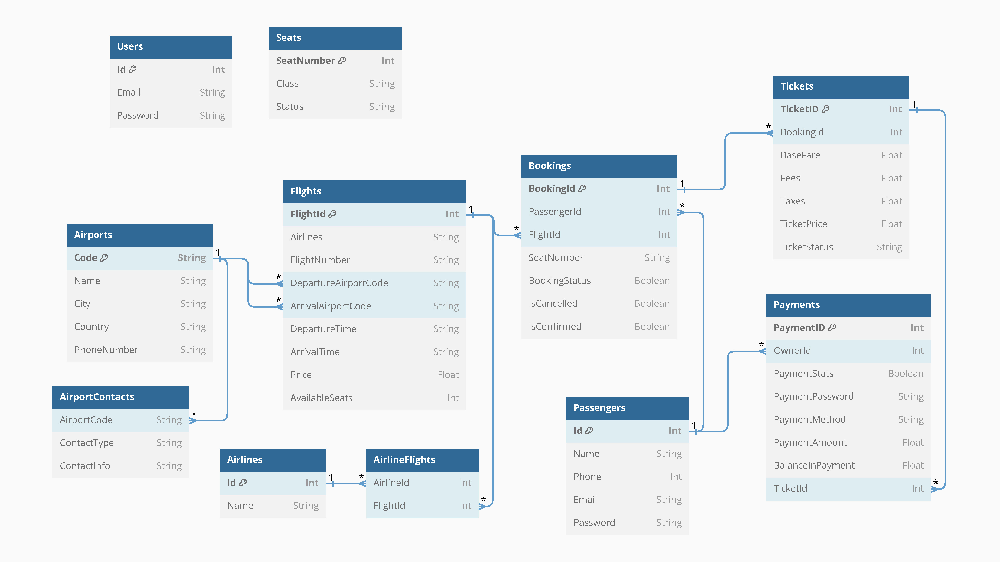

# Flight Reservation System


## Table of Contents

- [Introduction](#introduction)
- [Features](#features)
- [OOP Concepts](#oop-concepts)
- [Class Descriptions](#class-descriptions)
- [Usage](#usage)
- [Installation](#installation)
- [Contributing](#contributing)
- [License](#license)

## Introduction

Welcome to the Flight Reservation System! This project was developed as part of the Object-Oriented Programming (OOP) course at FCIS Ain Shams University. It is a comprehensive system that manages flights, passengers, bookings, payments, and more.

## Features

- User authentication and management (Admin and Passenger roles)
- Flight information storage and retrieval
- Booking and ticket management
- Payment processing and validation
- Seat availability management

## OOP Concepts

This project demonstrates the following OOP concepts:

- **Abstraction**: Representing abstract classes such as `User` to define common attributes and methods.
- **Inheritance**: Extending the `User` class to create specific user types like `Admin`.
- **Encapsulation**: Encapsulating data and providing methods to interact with the data securely.
- **Polymorphism**: Using upcasting and downcasting to interact with different user types through a common interface.
- **File Handling**: Storing and retrieving data from files for persistence.

## Class Descriptions

### User Classes

- **User**: An abstract class representing common user attributes and methods.
- **Admin**: Extends `User`, allowing administrative actions like updating flight details and managing system settings.

### Flight and Airport Classes

- **Flight**: Stores flight information and handles data storage and retrieval.
- **Airport**: Represents airport information including code, name, city, and country.

### Passenger and Payment Classes

- **Passenger**: Manages passenger details and data persistence.
- **Payment**: Handles payment processing, validation, and linking to tickets.

### Booking and Ticket Classes

- **Booking**: Manages bookings, including generating booking IDs and confirming bookings.
- **Ticket**: Represents tickets, calculates prices, and manages ticket details.

### Seat Class

- **Seat**: Represents aircraft seats with attributes like seat number, class, and availability status.

#Here is the project's Schema

## Usage

To use the Airline Reservation System, follow these steps:

1. Clone the repository.
2. Compile and run the project using your preferred IDE or command line.
3. Use the provided interfaces to interact with the system as an admin or passenger.

## Installation

1. Clone the repository:
    ```bash
    git clone https://github.com/abraam318/Flight-reservation.git
    ```
2. Navigate to the project directory:
    ```bash
    cd Flight-reservation
    ```
3. Compile and run the project.

## Contributing

We welcome contributions! Please fork the repository and submit a pull request.


